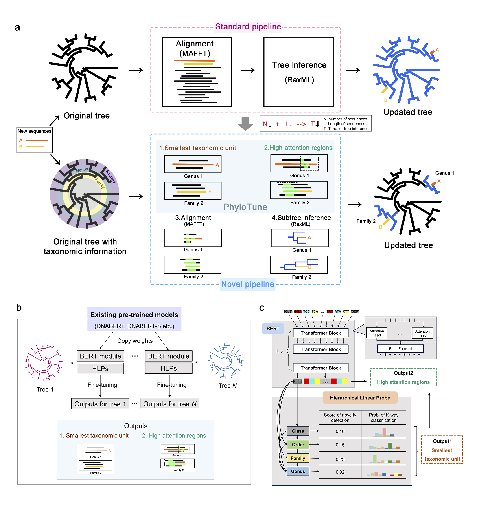

# PhyloTune: An Efficient Method to Accelerate Phylogenetic Updates Using a Pretrained DNA Language Model

[](https://github.com/danruod/PhyloTune)
[](https://github.com/danruod/PhyloTune/blob/main/LICENSE)
[](https://github.com/danruod/PhyloTune/blob/main/DATA_LICENSE)


> **Authors**: Danruo Deng, Wuqin Xu*, Bian Wu, Hans Peter Comes, Yu Feng, Pan Li*, Jinfang Zheng*, Guangyong Chen*, and Pheng-Ann Heng.  
 **Affiliations**: CUHK, Zhejiang Lab, Salzburg Universit, Chengdu Institute of Biology (CAS), Zhejiang University, Hangzhou Institute of Medicine (CAS).

**PhyloTune** is a novel method designed to accelerate phylogenetic tree updates by reducing the number and length of input sequences required for alignment and tree analysis. It achieves this by identifying the **smallest taxonomic unit** for newly collected sequences on a given phylogenetic tree and extracting the **high-attention regions** of sequences within that smallest taxonomic unit.

<!-- Understanding the phylogenetic relationships among species is crucial for comprehending major evolutionary transitions, serving as the foundation for many biological studies. Despite the ever-growing volume of sequence data providing a significant opportunity for biological research, constructing reliable phylogenetic trees effectively becomes more challenging for current analytical methods. In this study, we introduce a novel solution to accelerate phylogenetic updates using a pretrained DNA language model. Our approach identifies the taxonomic unit of a newly collected sequence using existing taxonomic classification systems and updates the corresponding subtree, akin to surgical corrections on a given phylogenetic tree. Specifically, we leverage a pretrained BERT network to obtain high-dimensional sequence representations, which are used not only to determine the subtree to be updated but also identify potentially valuable regions for subtree construction. We demonstrate the effectiveness of our method, named PhyloTune, through experiments on our established Plant dataset (focused on Embryophyta) and microbial data (focused on Bordetella genus). Our findings provide the first evidence that phylogenetic trees can be constructed by automatically selecting the most informative regions of sequences, without manual selection of molecular markers. This discovery offers a robust guide for further research into the functional aspects of different regions of DNA sequences, enriching our understanding of biology. -->




## 🛠️ System Requirements

We here discuss hardware and software system requirements.

### Hardware Dependencies

Our experiments require modern computer hardware suitable for machine learning research. We recommend using one or more graphics processor units (GPUs) to accelerate model inference. Without a GPU, it may be difficult to reproduce our results in a reasonable amount of time.


### Software Dependencies

Our code relies on Python 3.11.9 with PyTorch 2.5.1. We list the exact versions for all packages in [environment.yml](environment.yml).


## 📑 Installation Guide

To install Python with all necessary dependencies, we recommend the use of conda, and we refer to [https://conda.io/](https://conda.io/) for an installation guide. After installing conda, please execute the following commands to download the code and set up a new conda environment with all required packages:


```
git clone --recursive https://github.com/danruod/PhyloTune.git
cd PhyloTune/
  
conda env create -f environment.yml
conda activate PhyloTune
```

We recommend running on a Linux system. The setup should be completed within a few minutes. 

Before running the code, you need to manually download the datasets and model parameters.

* The dataset needs to be [downloaded](https://drive.google.com/drive/folders/1NwwAJog1_i_2X_sZKdQPaNeA0UnhPcj2) manually and stored in the datasets folder under the PhyloTune directory (`./datasets/`). This folder contains the **Plant**, ***Bordetella***, and **Simulated** datasets. Alternatively, you can directly download the zip files in the datasets directory and unzip them.

* The model parameters of PhyloTune need to be [downloaded](https://drive.google.com/drive/folders/1QdMSYhDdUKIyxPNlROSnZUkV45E7UmrK) manually and stored in the checkpoints folder under the PhyloTune directory (`./checkpoints/`), or you can directly download the checkpoints.zip file and unzip it. There are two folders in total:

  * plant_dnabert: Model parameters obtained by fine-tuning the **Plant** dataset using DNABERT as the backbone.

  * bordetella_dnaberts: Model parameters obtained by fine-tuning the ***Bordetella*** dataset using DNABERT-S as the backbone.

Note: For simulated datsets, we used DNABERT-S to fine-tune the HLPs designed for these dataset. 


## 🚀 Quick-starter code

### Demo for PhyloTune

The following code provides a demo of how PhyloTune, trained on the **Plant** dataset, works in practice:

  ```
  python main.py PhyloTune --dataset Plant --seqs "TAGAGGAAGGGAGAAGTCGTAACAAGGTTTCCGTAGGTGAACCTGCGGAAGGATCATTGTCGTGACCCTGACCAAAACAGACCGCGCACGCGTCATCCTGCCCGCCGGGCGGCGGCACCGTCTGTCGCCCAGCCAAAGTCCTCGAWAACCTCCTCTCTTCGGAGGGGCGGCTCGGGGTAAAAGAACCCACGGCGCCGAAGGCGTCAAGGAACACTGTGCCTAACCCGGGGACGCGGCTGGCTTGCTRGCCGCACCTTGGGTTGCAATGCTATATAATCCACACGACTCTCGGCAACGGATATCTCGGCTCTCGCATCGATGAAGAACGTAGCGAAATGCGATACCTGGTGTGAATTGCAGAATCCCGCGAACCATCGAGTCTTTGAACGCAAGTTGCGCCCGAGGCCTTCTGGCCGAGGGCACGCCTGCCTGGGCGTCACGCCAAACACGCTCCCACCCCACTAAACATGGGGCGGGATGCGGCATGTGGCTCTCCRTCTCGCAAGGGGCGGTGGGCCGAAGATCCGGCTGCCGGCGTATCGTKCCGGACACAGCGCGTGGTAGGCGATCTCGCTATACTAAACGCAGTGCATCCGGGACGTAGCCGACGCAATGCCCTCAATGGACCCTATTAACGGAGCGCACGACGTTTCGACCGCGACCCCAGGTCAGGCGGGACTACCCGCTGAATTTAAGCATATCAATAAGCGGAGGA" "TTAATACCATACCCCCTCCATCTGGAAATTTTGGTTCAAATTATTCGCTATTGGGTGAAAGATGCCTCTTCGTTGCATTTATTACGGTTTTTTCTTCACGAGTATTGTAATTGGAATAGTCTTATTACTCCAAATAAATTGATTTCTTTTTTTTCAAAAGAAAATCGAAGATTATTCTTGTTCCTATATAATTCTCATGTATGTGAATACGAATCTATTTTACTTTTTCTCCGTAACCAATCTTCTCATTTACGGTTAACATCTTATAGGTTTTTTTTTGAGCGAGTATATTTTTATGGAAAAATAGAACATCTTGTAAAAGTATTTGCTAATTATTTTCGGGCTATCCTACGGGTCTTCAAGCATCCTTTTATACATTATGTTAGATATCAAGGAAAAGCAATTCTGGTTTCAAAAGATACGCCTCTTCTGATGAATAAGTGGAAATATTACCTTGTCCATTTATGGCAATGTTATTTTTATGTGTGGTCACAACCAGAGAGGATCTATATAAACCAATTATCCAAGCGTTCTCTTGCCTTTTTGGGCTATATTTCAAGTGTGCGACTAAATCCTTCAGTGGTACGGAGTCAAATGCTAGAAAATGAATTTCTAATGGATAATGGTATGAAGAAACTCGATACACTAGTTCCAATTATGAAACTGCTTGTATCATTGGCTAAAGCTAAATTTTGTAACGTATTAGGGCATCCCATTAGTAAGCCGACCTGGGCGGATTCGTCAGATTTTGATATTATCGATCGATTTTTGCGTATATGCAGAAATCTTTCTCATTATTACAGTGG" --marker its --num_segs 3 --k 1 
  ```

Given one or more new sequences from a specific marker, this code performs the following tasks:

👉 1.   Identify the **smallest taxonomic unit**:

*   Determine the smallest clade in the phylogenetic tree to which the new sequence(s) belong.
*   Combine clades with overlapping regions to simplify downstream analysis.

👉 2.   Extract **high-attention regions**: Extract and output the high-attention regions from the merged clades' sequences. The sequences are divided into --num_segs segments, and high-attention regions are identified as the top --k average attention regions.

These extracted high-attention regions can then be used with existing tools like MAFFT (for sequence alignment) and RAxML (for tree inference) to efficiently update the topology of the corresponding subtree. We also provide a [Colab](https://colab.research.google.com/drive/1l2EdbAehS79a5GSy4PyGoVZv-nwjJ4Lt) for your reference.

### Reproduce Results for PhyloTune

To reproduce the evaluation results for the smallest taxonomic unit in the paper, use the following command:

  ```
  python main.py eval_taxa --dataset Plant --batch_size 16
  ```

To reproduce the attention analysis evaluation results from the article, use this command:

  ```
  python main.py  attn_analysis --dataset Plant --metrics hetero sub_rate fst dxy
  ```

If you wish to use the bordetella dataset instead, simply specify --dataset Bordetella.

### Fine-tuning on Simulated Datasets

To fine-tune phyloTune on simulated datasets, use the following command:

  ```
  python simulated.py
  ```


## ✉️ Contact
Feel free to contact me (Danruo DENG: [drdeng@link.cuhk.edu.hk](mailto:drdeng@link.cuhk.edu.hk)) if anything is unclear or you are interested in potential collaboration.
